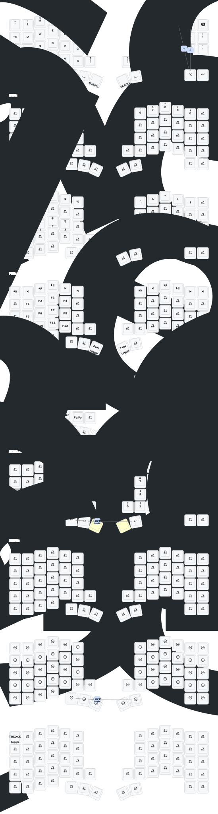

# Keyball61 ZMK config

Configuracion personal para mi Keyball61 Bluetooth con ZMK.

Este repo compila firmware UF2 con GitHub Actions. La idea es cambiar archivos
de configuracion, pushear, descargar el artifact `firmware.zip`, y flashear el
UF2 correcto en el lado correspondiente del teclado.

## Para cambiar comportamiento del Keyball61

### 1. Modificar el archivo correspondiente

Elegir el archivo segun la parte fisica o comportamiento que se quiere controlar:

- `config/keyball61.keymap`
  - Teclas, layers, combos visibles en keymap, Bluetooth behaviors, clicks del
    mouse en la layer `MOUSE`, controles multimedia, Page Up/Page Down, etc.
  - Este es el archivo que mas voy a tocar.

- `config/boards/shields/keyball61/keyball61_right.conf`
  - Config del lado derecho.
  - Trackball PMW3610: velocidad/CPI, divisor CPI, scroll, snipe, timeout de
    automouse.
  - ZMK Studio en el lado derecho.
  - Como el lado derecho es central/master, muchos cambios se prueban
    flasheando solo este lado.

- `config/boards/shields/keyball61/keyball61_right.overlay`
  - Pines y hardware del lado derecho.
  - Sensor del trackball.
  - `automouse-layer`, `scroll-layers`, `snipe-layers`.
  - Tocar con cuidado: esto ya es hardware/firmware, no simple layout.

- `config/boards/shields/keyball61/keyball61_left.conf`
  - Config especifica del lado izquierdo.
  - Normalmente no hace falta tocarlo para cambios de layout.

- `config/boards/shields/keyball61/keyball61_left.overlay`
  - Pines y hardware del lado izquierdo.
  - Tocar solo si se esta cambiando soporte de hardware del lado izquierdo.

- `config/boards/shields/keyball61/keyball61.dtsi`
  - Matriz fisica, transform y layout fisico.
  - Define como las posiciones fisicas se relacionan con el keymap.
  - No tocar para cambios normales de teclas.

- `config/boards/shields/keyball61/Kconfig.defconfig`
  - Define defaults del shield.
  - Aqui queda marcado que `keyball61_right` es el central/master.

- `config/boards/shields/keyball61/Kconfig.shield`
  - Declara los shields `keyball61_left` y `keyball61_right`.

- `config/keyball61.conf`
  - Config general del teclado.
  - Opciones Bluetooth, display, split, power, etc.

- `config/west.yml`
  - Dependencias de build.
  - Incluye ZMK y `zmk-pmw3610-driver`, necesario para el trackball.

- `build.yaml`
  - Matriz de GitHub Actions.
  - Define que firmwares se compilan:

```yaml
include:
  - board: nice_nano_v2
    shield: keyball61_left
  - board: nice_nano_v2
    shield: keyball61_right
    snippet: studio-rpc-usb-uart
  - board: nice_nano_v2
    shield: settings_reset
```

- `keymap_drawer.config.yaml`
  - Config para dibujar el keymap.
  - No cambia el firmware.

- `keymap-drawer/keyball61.svg`
  - Dibujo generado del keymap.
  - Util para inspeccion visual, no para firmware.

### 2. Hacer commit del cambio

Describir el cambio con una frase concreta:

```bash
git add .
git commit -m "cambio hecho fue tal cosa"
git push
```

Ejemplos:

```bash
git commit -m "ajusta clicks y movimiento en layer mouse"
git commit -m "sube velocidad del trackball y timeout automouse"
git commit -m "agrega controles multimedia en layer mouse"
```

### 3. Esperar GitHub Actions y descargar firmware

Ir a GitHub Actions:

- https://github.com/rodrigo1392/zmk-config-k61-rr/actions

Run usado como referencia:

- https://github.com/rodrigo1392/zmk-config-k61-rr/actions/runs/26783110504

Esperar a que termine de compilar. Descargar el artifact llamado:

```text
firmware.zip
```

Descomprimirlo. Deberia traer archivos parecidos a:

```text
keyball61_left-nice_nano_v2-zmk.uf2
keyball61_right-nice_nano_v2-zmk.uf2
settings_reset-nice_nano_v2-zmk.uf2
```

Guardar las compilaciones que funcionaron en `vault/`, idealmente con fecha y
nota corta:

```text
vault/2026-06-01-mouse-layer-ok/keyball61_right-nice_nano_v2-zmk.uf2
vault/2026-06-01-mouse-layer-ok/README.md
```

### 4. Flashear el lado derecho

Para cambios normales de keymap o trackball, empezar por el lado derecho.

1. Apagar el lado derecho del Keyball61.
2. Conectarlo por USB.
3. Dar doble clic en su boton reset para entrar al bootloader.
4. Debe aparecer una unidad llamada `NICENANO`.
5. Copiar el archivo:

```text
keyball61_right-nice_nano_v2-zmk.uf2
```

en la raiz de `NICENANO`.

6. Esperar a que el teclado reinicie.
7. Probar primero por USB.
8. Probar Bluetooth, trackball, clicks y layers.

No hacer nada con el lado izquierdo salvo que el cambio lo requiera. El lado
derecho es el central/master.

No usar `settings_reset` como firmware normal. Ese UF2 sirve para borrar settings
persistentes/pairings cuando hay problemas.

## Historia

Primero intente usar la guia oficial de ZMK:

- https://zmk.dev/docs/user-setup

No me funciono bien en este caso porque no pude llegar a compilar una config
propia desde cero para Keyball61.

Luego recurri a:

- https://github.com/tangbonze/zmk-config-Keyball61

Clone ese repo y lo pushee sin tocar nada. Eso funciono. Desde entonces este
repo es mi base funcional: cambio cosas de keymaps/config con ayuda de Codex,
compilo con GitHub Actions, flasheo el lado derecho, y guardo los UF2 que
funcionaron en `vault/`.

## Cuidados e instrucciones semioficiales

La mejor referencia que encontre es el README de `superxc3/zmk-config-Keyball61`,
que parece venir de ensambladores, vendor o gente muy cercana al hardware:

- https://github.com/superxc3/zmk-config-Keyball61/blob/main/README.md#charging

Notas importantes de esa referencia:

- Para Keyball61, el master/central es el lado derecho.
- Si solo cambio el keymap, normalmente basta flashear el lado derecho.
- Para uso cableado confiable, conectar USB al lado derecho.
- La izquierda puede quedar wireless mientras la derecha esta por USB.
- Para cargar, conectar cable y poner power encendido.
- El README dice que el switch hacia la izquierda en ambos lados enciende el
  teclado.
- Para entrar al bootloader, usar doble presion rapida de los botones/combo de
  esquina o doble clic en reset, segun el montaje.
- No borrar archivos dentro de `NICENANO`; solo copiar el UF2 nuevo.
- Normalmente no hace falta re-pair despues de flashear firmware normal.

## Notas para no redescubrir todo

- `artifact` en GitHub Actions significa "archivo generado por el workflow".
  En este repo, el artifact importante es `firmware.zip`.
- El artifact no cambia el teclado por si solo. Hay que descargarlo,
  descomprimirlo y copiar el `.uf2` correcto a `NICENANO`.
- `keyball61_right...uf2` es el firmware del lado derecho.
- `keyball61_left...uf2` es el firmware del lado izquierdo.
- `settings_reset...uf2` es para resetear settings/pairings; no es firmware de
  uso normal.
- Si un push falla por ramas divergentes:

```bash
git pull --rebase
git push
```

- Si GitHub Actions falla, mirar:

```bash
gh run list --limit 5
gh run view --log-failed
```

- Para generar cambios de keymap de bajo riesgo:
  - cambiar `config/keyball61.keymap`;
  - commit/push;
  - descargar artifact;
  - flashear solo `keyball61_right`.

- Para cambiar velocidad del trackball:
  - editar `config/boards/shields/keyball61/keyball61_right.conf`;
  - `CONFIG_PMW3610_CPI` y `CONFIG_PMW3610_CPI_DIVIDOR` controlan velocidad;
  - menor divisor = mas rapido;
  - `CONFIG_PMW3610_AUTOMOUSE_TIMEOUT_MS` controla cuanto dura la layer mouse
    despues de mover la bola.

- Para cambiar que layer activa el trackball:
  - editar `config/boards/shields/keyball61/keyball61_right.overlay`;
  - revisar `automouse-layer`, `scroll-layers`, `snipe-layers`.

- Para cambiar clicks:
  - editar layer `MOUSE` en `config/keyball61.keymap`;
  - `&mkp LCLK` es click izquierdo;
  - `&mkp RCLK` es click derecho;
  - `&mkp MCLK` es click medio.

- Para Bluetooth:
  - buscar `&bt BT_SEL 0`, `&bt BT_SEL 1`, etc. en `config/keyball61.keymap`;
  - ZMK normalmente maneja 5 perfiles Bluetooth.

- Para dibujo visual del keymap:
  - `keymap_drawer.config.yaml` no cambia firmware;
  - `keymap-drawer/keyball61.svg` es el dibujo generado.

## Creditos originales

This keeb created by a group of people who loves keyball.

Special Thanks to: <br>
PCB: *[yangxing844](https://github.com/yangxing844)* <br>
Case: *[delock](https://github.com/delock)* <br>
Firmware: *[Amos698](https://github.com/Amos698)* <br>


